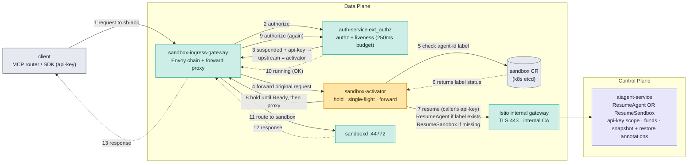
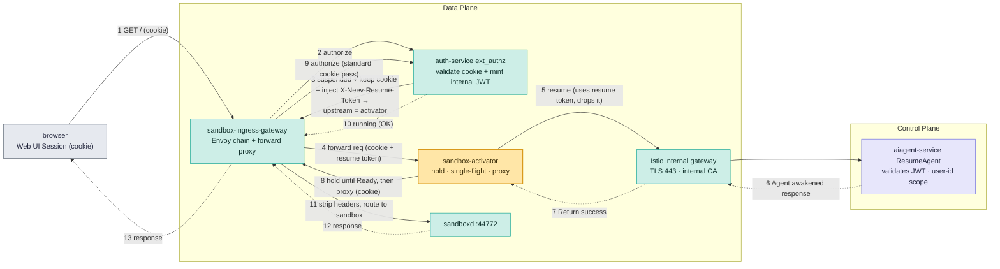
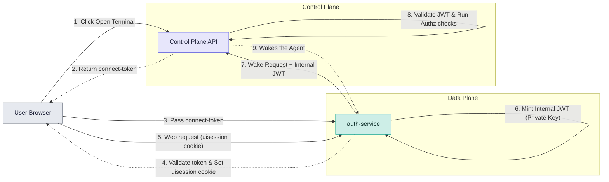

# RFC: Internal JWT Minting for Agent Auto-Resume

Status: Draft

## Summary

**Agent auto-resume** is the mechanism that wakes a paused agent sandbox when a user attempts to connect to it. This RFC proposes how this will work natively for **interactive CLI and SSH sessions**: when a user executes a command, the system reads their authentication token, checks the Sandbox Custom Resource for the `agent-id` label, and explicitly resumes the agent on their behalf. 

Auto-resuming via **Web UI sessions** presents a different challenge. Browsers rely on session cookies. When a request comes in, the edge auth service validates and strips the cookie before routing traffic to the internal `sandbox-activator`. 

When the `sandbox-activator` receives traffic for a paused agent, it must forward a Resume request to the Control Plane (CP). The CP needs to authenticate this request. However, because the cookie was already stripped at the edge, the activator has no identity context to send to the CP. Without this, the CP cannot authenticate *who* is attempting to wake the agent, and because the CP only authenticates API Keys and JWTs (enforced via `pkg/middleware`), it rejects the request.

This document explores approaches to solve this problem. We must find a secure way to pass the user's identity to the Control Plane during Web UI sessions. Identifying the user is a strict requirement to ensure accurate billing, security, and clear audit traces.

The target access patterns are:
- **CLI/SSH.** A developer runs commands or SSHs directly into the agent. 
- **Web UI.** A user interacts with the OpenClaw or OpenCode sandbox proxy via a browser session.


## Flow 1: API-key auto-resume

When a user interacts with a sandbox by providing an external API key (e.g., for SSH, Exec, or File Ops), the system will use the following approach to auto-resume the agent.


**Flow Details:**
1. **Client Request:** A client (e.g., MCP router or SDK) sends a request to an **agent-backed sandbox** using an API key. This request hits the **sandbox-ingress-gateway** (an Envoy chain + forward proxy) in the Data Plane.
2. **Authorize:** The gateway makes an `ext_authz` call to the **auth-service** for authorization and liveness checks (operating on a tight 250ms budget).
3. **Upstream Routing:** If the agent is paused, the `auth-service` instructs the gateway to dynamically set the upstream destination to the **sandbox-activator**.
4. **Forwarding:** The gateway forwards the original request to the `sandbox-activator`, which uses hold, single-flight, and forward logic.
5. **CR Lookup:** The `sandbox-activator` queries the Kubernetes **Sandbox CR** (whose state is persisted in `etcd`) to check for the presence of the `agent-id` label.
6. **CR Response:** The label status is returned to the activator.
7. **Triggering CP:** The activator sends a resume request (passing along the caller's API key) through the **Istio internal gateway** (the DP-to-CP path secured with an internal CA) to the **aiagent-service** in the Control Plane. 
   - **If `agent-id` is present:** It calls the `ResumeAgent` API.
   - **If `agent-id` is missing:** It calls the standard `ResumeSandbox` API (returns **409 Conflict** if the sandbox is actually agent-backed).
   The CP service evaluates API key scopes, validates funds, and processes snapshot and restore annotations to unpause the agent.
8. **Holding & Proxying:** The activator holds the original request until the agent transitions to `Ready`. Once ready, it proxies the connection back to the **sandbox-ingress-gateway**.
9. **Re-Authorization:** The gateway receives the proxied request and once again makes an `ext_authz` call to the **auth-service**. 
10. **Final Routing:** Because the agent is now running, the auth-service allows the request and routes the traffic to `sandboxd` (port 44772) on the resumed agent.
11. **Response:** The response is finally returned to the client.



## Flow 2: Web UI auto-resume

When resuming an **agent-backed sandbox** via a Web UI, the browser uses a session Cookie. The challenge here is that the Auth Service validates and strips this Cookie before forwarding the request to the `sandbox-activator`. 

Because the cookie is deleted at the edge, the `sandbox-activator` receives the request without any user identity. If the activator attempts to send a resume request to the Control Plane without these authentication fields, the request will be rejected.

To resolve this identity propagation issue, the following architecture defines how to securely pass the user's identity to the Control Plane.

### Auth Service Internal JWT Minting

The `auth-service` acts as a token-exchange layer, minting a secure internal JWT that the Control Plane can natively validate to authenticate the user.

**How it works:**
1. The **sandbox-ingress-gateway** receives the Web UI request and triggers `ext_authz` on the **auth-service**.
2. The `auth-service` validates the session cookie, extracts the user ID, and **mints a narrow, single-purpose internal JWT** (resume token). 
3. The `auth-service` injects this JWT into a custom header named `X-Neev-Resume-Token`. It explicitly avoids using the standard `Authorization` header so it doesn't accidentally overwrite or erase passwords needed by web apps running inside the user's sandbox (like Code Server). The `auth-service` also leaves the user's original session cookie attached to the request.
4. The gateway routes the suspended request to the `sandbox-activator`.
5. The activator extracts the `X-Neev-Resume-Token`, forwards the Resume request (passing the token) to the **aiagent-service** (Control Plane) to unpause the agent, and drops the token. Its single-flight key is based on `sandbox_id` plus user, rather than the raw token.
6. The activator holds the user's original HTTP connection open while it waits for the agent Pod to become `Ready`.
7. Once `Ready`, the activator proxies the connection (with the original session cookie still attached) back to the **sandbox-ingress-gateway**.
8. The gateway runs `ext_authz` again. Because the cookie was preserved, this functions as an ordinary cookie validation. The **auth-service** validates the request, and the gateway strips the cookie and any `X-Neev-Resume-Token` headers before routing the traffic to the untrusted `sandboxd` container.



### Token Design

To securely propagate user identity to the Control Plane, the `auth-service` will generate a short-lived internal JWT with the following specifications:

#### Token Lifecycle Flow


1. **Key management and signing**
   - The token uses asymmetric signing. To support this, we must generate a dedicated key pair and configure the **Internal Private Key in the Data Plane** (`auth-service`) to mint tokens, and the **Internal Public Key in the Control Plane** (`aiagent-service`) to verify them.
   - **Why not reuse the existing HMAC secret?** We cannot reuse the existing `UI_SESSION_KEY` because it creates a massive security vulnerability. If a hacker breaches the Data Plane and steals this master secret, they could forge global user tokens, gain unauthorized access to the Control Plane, and wake or control any agent in the entire platform. Using a dedicated asymmetric key prevents a compromised Data Plane from forging full-access user tokens.
   - **Performance:** Generating this token in the `auth-service` is extremely fast (typically **< 1-2 milliseconds**). This ensures that the token minting process easily fits within the strict 250ms latency budget allocated for the `ext_authz` call.
2. **Token Payload (Claims)**
   - **Identity:** Must include `sub` (user ID), `org_id`, `project_id`, `sandbox_id`, `agent_id`, and `plan_id`.
   - **Metadata:** Must include `aud` (`aiagent-service`), `iss` (`auth-service` with region), `exp` (expiration), `jti` (unique identifier), and `scope=resume`.
3. **Token Lifetime and Scope**
   - The token enforces a strict 120-second TTL (`exp`). This window accommodates network propagation and subsequent agent boot times while minimizing the risk of token leakage.
   - The token is strictly single-purpose and scoped to the target sandbox. 
   - Replay attacks are mitigated by tracking the unique `jti` claim on the Control Plane to enforce single-use semantics.
4. **User ID Source**
   - The `auth-service` extracts the User ID directly from the user's `uisession` cookie.
5. **Control Plane Validation**
   - The Control Plane must be updated to validate the internal JWT using the trusted public keys. Once authenticated, the existing authorization pipeline will automatically enforce standard checks (e.g., billing, permissions), exactly as it currently does for standard UI tokens.
6. **Injected Header Structure**
   - When the `auth-service` injects the internal JWT, the HTTP request forwarded to the `sandbox-activator` will be structured like this:
   ```http
   GET / HTTP/1.1
   Host: <sandbox-id>.proxy.neevcloud.com
   Cookie: uisession=<original_session_cookie>
   X-Neev-Resume-Token: eyJhbGciOiJSUzI1NiIsInR5cCI6IkpXVCJ9...
   ```

## Security
- The internal JWT (resume token) minted by `auth-service` is strictly short-lived and only valid for internal service-to-service communication.
- The `X-Neev-Resume-Token` header and the raw session cookie are strictly stripped by the gateway before requests are finally routed into the untrusted `sandboxd` environment.

## Rejected Alternatives

| Approach | Concept | Reason for Rejection |
| :--- | :--- | :--- |
| **Auth Service Header Injection** | `auth-service` validates and strips cookie, injecting an `X-Neev-User-ID: <uuid>` plain-text header. Activator forwards this User ID header to the CP. | **CP Validation Failure:** The Control Plane authenticates requests using API Keys or JWTs. It will reject the request because it cannot authorize actions based purely on a plain-text User ID. |
| **Server API Key Bypass** | Activator bypasses user validation by injecting a master `Server API Key` to authenticate the Resume request against the CP. | **Breaks Tracing & Billing:** While this bypasses CP validation, it destroys user-level tracing and accurate billing attribution. The Control Plane logs the action under the Server identity, completely losing the identity of the user who initiated the resume. |
| **Authorization Header Overwrite** | `auth-service` injects the internal JWT into the `Authorization` header instead of a custom header. | **Breaks Sandbox Apps:** Web applications running inside the user's sandbox (e.g., Code Server) may rely on their own `Authorization` headers. Overwriting or stripping this header at the edge breaks native application functionality. |
