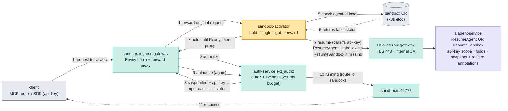
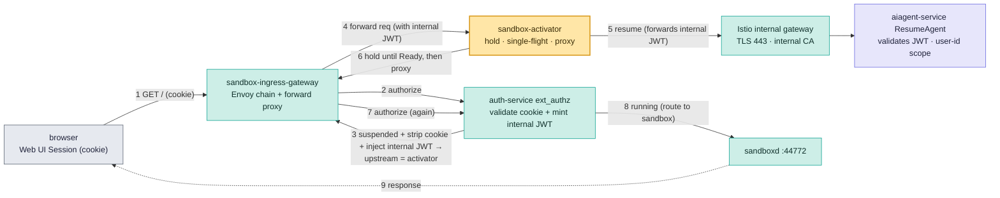

# Agent Auto-Resume

Status: Draft

## Summary

**Agent auto-resume** is the mechanism that wakes a paused agent sandbox when a user attempts to connect to it. Today, this works natively for **interactive CLI and SSH sessions**: when a user executes a command, the system reads their authentication token, checks the Sandbox Custom Resource for the `agent-id` label, and explicitly resumes the agent on their behalf. 

Auto-resuming via **Web UI sessions** presents a different challenge. Browsers rely on session cookies. When a request comes in, the edge auth service validates and strips the cookie before routing traffic to the internal `sandbox-activator`. 

When the `sandbox-activator` receives traffic for a paused agent, it must forward a Resume request to the Control Plane (CP). The CP needs to authenticate this request. However, because the cookie was already stripped at the edge, the activator has no identity context to send to the CP. Without this, the CP cannot authenticate *who* is attempting to wake the agent.

This document explores approaches to solve this problem. We must find a secure way to pass the user's identity to the Control Plane during Web UI sessions. Identifying the user is a strict requirement to ensure accurate billing, security, and clear audit traces.

The target access patterns are:
- **CLI/SSH.** A developer runs commands or SSHs directly into the agent. 
- **Web UI.** A user accesses an agent's exposed preview port (e.g., port 3000) via a browser session.

## Approach followed when user interacts with agent-backed sandbox using external API key

When a user interacts with a sandbox by providing an external API key (e.g., for SSH, Exec, or File Ops), the system uses the following approach to auto-resume the agent.

**Flow Details:**
1. **Client Request:** A client (e.g., MCP router or SDK) sends a request to an **agent-backed sandbox** using an API key. This request hits the **sandbox-ingress-gateway** (an Envoy chain + forward proxy) in the Data Plane.
2. **Authorization & State Check:** The gateway makes an `ext_authz` call to the **auth-service** for authorization and liveness checks (operating on a tight 250ms budget).
3. **Upstream Routing:** If the agent is paused, the `auth-service` instructs the gateway to dynamically set the upstream destination to the **sandbox-activator**.
4. **Forwarding:** The gateway forwards the original request to the `sandbox-activator`, which uses hold, single-flight, and forward logic.
5. **CR Lookup:** The `sandbox-activator` queries the Kubernetes **Sandbox CR** (whose state is persisted in `etcd`) to check for the presence of the `agent-id` label.
6. **Triggering CP:** The activator sends a resume request (passing along the caller's API key) through the **Istio internal gateway** to the **aiagent-service** in the Control Plane. 
   - **If `agent-id` is present:** It calls the `ResumeAgent` API.
   - **If `agent-id` is missing:** It calls the standard `ResumeSandbox` API.
   The CP service evaluates API key scopes, validates funds, and processes snapshot and restore annotations to unpause the agent.
8. **Re-Authorization & Final Routing:** The gateway receives the proxied request and once again makes an `ext_authz` call to the **auth-service**. Because the agent is now running, the auth-service allows the request and routes the traffic to `sandboxd` (port 44772) on the resumed agent.
9. **Response:** The response is finally returned to the client.

---

## Approaches for Web UI Sessions (Browser)

> [!NOTE]
> **Explicit Failures for Preview URLs and Connect-Tokens**
> A preview URL request against a paused **agent-backed sandbox** must fail without triggering a resume, and the agent-backed sandbox must remain paused. The same assertion applies for a connect-token request.
> We should only allow auto-resume to be triggered via the main Web UI, explicitly failing and preventing auto-resume for preview URLs and connect-tokens.
> **Reasoning:** Preview URLs can often be accessed by unauthenticated external users or automated scanners. Allowing these endpoints to trigger auto-resume could lead to unintended wake-ups, draining user funds and incurring unexpected compute costs. By restricting auto-resume strictly to the main Web UI (and authorized API keys), we guarantee that agents are only awakened by intentional actions from the rightful owners.

When resuming an **agent-backed sandbox** via a Web UI, the browser uses a session Cookie. The challenge here is that the Auth Service validates and strips this Cookie before forwarding the request to the `sandbox-activator`. 

> [!NOTE]
> **Why is the cookie stripped?**
> The `auth-service` intentionally deletes the session cookie at the edge gateway for security and least-privilege. Sandboxes run untrusted code; if the raw session cookie were passed through to the `sandboxd` container, malicious code could steal the cookie and hijack the user's entire NeevAI platform session. By stripping it at the edge, the internal services and sandboxes are kept secure.

Because the cookie is deleted at the edge, the `sandbox-activator` receives the request without any user identity. If the activator attempts to send a resume request to the Control Plane without these authentication fields, the request will be rejected.

To resolve this identity propagation issue, the following architecture defines how to securely pass the user's identity to the Control Plane.

### Auth Service Internal JWT Minting

The `auth-service` acts as a token-exchange layer, minting a secure internal JWT that the Control Plane can natively validate to authenticate the user.

**How it works:**
1. The **sandbox-ingress-gateway** receives the Web UI request and triggers `ext_authz` on the **auth-service**.
2. The `auth-service` validates the session cookie, extracts the user ID, and **mints a short-lived internal JWT**. 
3. The `auth-service` injects this JWT as an `Authorization` Bearer token and securely strips the raw session cookie.
4. The gateway routes the suspended request to the `sandbox-activator`.
5. The activator forwards the Resume request (passing the internal JWT) to the **aiagent-service** (Control Plane) to unpause the agent.
6. The activator holds the user's original HTTP connection open while it waits for the agent Pod to become `Ready`.
7. Once `Ready`, the activator proxies the connection (with the internal JWT still attached) back to the **sandbox-ingress-gateway**.
8. The gateway runs `ext_authz` again. The **auth-service** validates the internal JWT and MUST explicitly strip the `Authorization` header to prevent the internal JWT from leaking into the untrusted `sandboxd` container. Once stripped, it routes the traffic to the sandbox.

### Rejected Alternatives

| Approach | Concept | Reason for Rejection |
| :--- | :--- | :--- |
| **Auth Service Header Injection** | `auth-service` validates and strips cookie, injecting an `X-Neev-User-ID: <uuid>` plain-text header. Activator forwards this User ID header to the CP. | **CP Validation Failure:** The Control Plane authenticates requests using API Keys or JWTs. It will reject the request because it cannot authorize actions based purely on a plain-text User ID. |
| **Server API Key Bypass** | Activator bypasses user validation by injecting a master `Server API Key` to authenticate the Resume request against the CP. | **Breaks Tracing & Billing:** While this bypasses CP validation, it destroys user-level tracing and accurate billing attribution. The Control Plane logs the action under the Server identity, completely losing the identity of the user who initiated the resume. |
| **Direct Cookie Pass-through** | `auth-service` is configured to stop stripping the cookie. The raw cookie is forwarded directly to the `sandbox-activator` and CP for validation. | **CP Validation Failure & Security Risk:** If the activator forwards the raw cookie to the Control Plane to resume the agent, the CP will reject the request because it only authenticates API Keys and JWTs, not cookies. Additionally, this leaks highly-sensitive cookies to the Data Plane, risking session hijacking. |
