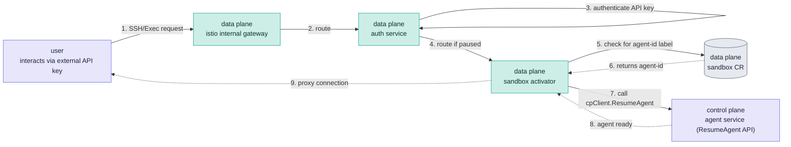
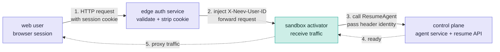
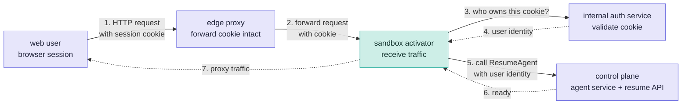

# RFC: Agent Auto-Resume

Status: WIP

## Summary

**Agent auto-resume** is the mechanism that wakes a paused agent sandbox when a user attempts to connect to it. Today, this works natively for **interactive CLI and SSH sessions**: when a user executes a command, the system reads their authentication token, checks the Sandbox Custom Resource for the `agent-id` label, and explicitly resumes the agent on their behalf. 

Auto-resuming via **Web UI sessions** presents a different challenge. Browsers rely on session cookies. When a request comes in, the edge auth service validates and strips the cookie before routing traffic to the internal `sandbox-activator`. 

When the `sandbox-activator` receives traffic for a paused agent, it must forward a Resume request to the Control Plane (CP). The CP needs to authenticate this request. However, because the cookie was already stripped at the edge, the activator has no identity context to send to the CP. Without this, the CP cannot authenticate *who* is attempting to wake the agent.

This document explores approaches to solve this problem. We must find a secure way to pass the user's identity to the Control Plane during Web UI sessions. Identifying the user is a strict requirement to ensure accurate billing, security, and clear audit traces.

The target access patterns are:
- **CLI/SSH.** A developer runs commands or SSHs directly into the agent. 
- **Web UI.** A user accesses an agent's exposed preview port (e.g., port 3000) via a browser session.

## Current Approach: Auto-Resuming Agents (Interactive / SSH)

When a user interacts with a sandbox by providing an external API key (e.g., for SSH, Exec, or File Ops), the system uses the following approach to auto-resume the agent.

**Flow Details:**
1. **User Interaction:** The user interacts with the agent-backed sandbox by providing an external API key (e.g., for SSH, Exec, or File Ops).
2. **Gateway:** The request first hits the **Istio Internal Gateway** in the Data Plane.
3. **Authentication:** The gateway routes the request to the **Data Plane Auth Service**, which authenticates the user's API key. 
4. **State Check & Routing:** If the agent is paused (e.g., sandbox pods are scaled to zero), the traffic is routed to the **Sandbox Activator**.
5. **CR Lookup:** When the request reaches the `sandbox-activator`, it queries the Kubernetes **Sandbox CR** to explicitly check if the `agent-id` label is present.
6. **Triggering CP:** Finding the `agent-id` label, the `sandbox-activator` uses its internal `cpClient` to forward a `ResumeAgent` API request to the Control Plane. It passes the authenticated user's identity securely via the request context.
7. **Control Plane Service:** The request is received by the **Agent Service** inside the Control Plane, which handles the actual unpausing logic.

---

## Approaches for Web UI Sessions (Browser)

When resuming an agent via a Web UI or preview URL, the browser uses a session Cookie. The challenge here is that the Auth Service validates and strips this Cookie before forwarding the request to the `sandbox-activator`. Therefore, the activator loses the user's identity and does not know *who* triggered the resume.

Below are the high-level approaches we can take to solve this for Web UI sessions.

### Approach 1: Auth Service Header Injection (Recommended)

In this approach, we modify the Auth Service (or Edge Gateway) to explicitly pass the user's identity to the internal services.

**How it works:**
1. The user navigates to the Agent's Web UI URL in their browser, sending the Session Cookie.
2. The Auth Service intercepts the request, validates the Cookie, and then strips it for internal security.
3. Crucially, the Auth Service injects a new secure HTTP header (e.g., `X-Neev-User-ID: <uuid>`) containing the authenticated user's ID.
4. The request is forwarded to the `sandbox-activator`.
5. The `sandbox-activator` reads the `X-Neev-User-ID` header to identify the user and calls the Agent Service to resume the agent.

**Pros:**
* Highly secure because the activator relies on the trusted Auth service and does not handle raw cookies.
* Lowest latency because the identity is resolved in-flight.
* The activator's logic remains very simple (just reading a header).

**Cons:**
* Requires configuration changes in the Auth Service or Edge routing rules.

### Approach 2: Activator Direct Cookie Validation

In this approach, we bypass edge stripping and let the activator handle the cookie.

**How it works:**
The Auth Service configuration is changed to *pass the session cookie through* to the `sandbox-activator`. When the activator receives the request, it extracts the cookie and makes a separate internal API call back to the Auth Service to validate it and get the user's ID.

**Pros:**
* No custom header injection logic is needed at the Edge layer.

**Cons:**
* Leaks raw session cookies to internal backend services, which is a security risk.
* High latency because it requires an extra network hop (Activator -> Auth Service -> Activator) before the resume can start.
* Duplicates authentication logic inside the activator.

### Approach 3: Short-Lived URL Tokens

This approach abandons cookies entirely for preview URLs.

**How it works:**
The Web UI frontend generates a short-lived, signed token (JWT) and appends it to the URL as a query parameter (e.g., `?token=xyz`). The Auth Service ignores it, and the `sandbox-activator` reads the URL parameter, validates the token, and extracts the user ID.

**Pros:**
* Completely avoids the problem of Edge services stripping cookies.
* Entirely stateless.

**Cons:**
* Creates ugly URLs.
* Security risk: If a user shares the URL, they leak their authentication token.
* Broken Assets: Web applications often request CSS, JS, or images dynamically without appending the `?token=`, which causes those specific requests to fail or fail to wake the agent.
