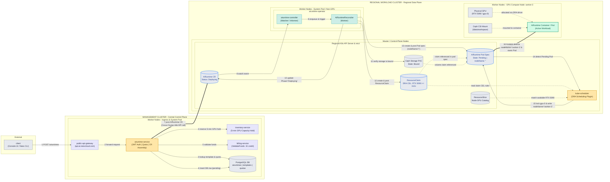

```mermaid
flowchart LR
    %% -------------------------------------------------------------
    %% 1. CLIENT
    %% -------------------------------------------------------------
    subgraph CLIENT_TIER [External]
        cl["client<br/>(Console UI / Neev CLI)"]:::store
    end

    %% -------------------------------------------------------------
    %% 2. MANAGEMENT CLUSTER (Central Control Plane)
    %% -------------------------------------------------------------
    subgraph MGMT [MANAGEMENT CLUSTER - Central Control Plane]
        subgraph MGMT_WORKERS [Worker Nodes - Ingress & System Pool]
            gw["public-api-gateway<br/>(api.ai.neevcloud.com)"]:::cp
            asvc["airuntime-service<br/>(JWT Auth | Quota | CR Assembly)"]:::star
            inv["inventory-service<br/>(5-min GPU Capacity Hold)"]:::cp
            bill["billing-service<br/>(ValidateFunds: 1h credit)"]:::cp
            db[("PostgreSQL DB<br/>airuntimes | templates | quotas")]:::store
        end
    end

    %% -------------------------------------------------------------
    %% 3. WORKLOAD CLUSTER (Regional Data Plane)
    %% -------------------------------------------------------------
    subgraph WKLD [REGIONAL WORKLOAD CLUSTER - Regional Data Plane]

        %% MASTER / CONTROL PLANE NODES
        subgraph WKLD_MASTER [Master / Control-Plane Nodes]
            subgraph K8S [Regional K8s API Server & etcd]
                cr_airuntime[("AIRuntime CR<br/>Status: Deploying")]:::k8s
                pvc[("Ceph Storage PVC<br/>State: Bound")]:::store
                rc[("ResourceClaim<br/>DRA CEL: RTX 5090 >= 31Gi")]:::k8s
                pod_obj[("AIRuntime Pod Spec<br/>State: Pending | nodeName: ''")]:::k8s
                rs[("ResourceSlice<br/>Node GPU Catalog")]:::store
            end
            sched["kube-scheduler<br/>(DRA Scheduling Plugin)"]:::star
        end

        %% SYSTEM WORKER NODES (NO GPU)
        subgraph WKLD_SYS_WORKER [Worker Nodes - System Pool / Non-GPU]
            subgraph OP [airuntime-operator]
                actrl["airuntime-controller<br/>(Watcher / Informer)"]:::dp
                arec["AIRuntimeReconciler<br/>(Worker)"]:::dp
            end
        end

        %% GPU COMPUTE WORKER NODES
        subgraph WKLD_GPU_WORKER [Worker Nodes - GPU Compute Node: worker-3]
            running_pod["AIRuntime Container / Pod<br/>(Active Workload)"]:::gpu
            gpu_hw["Physical GPU<br/>(RTX 5090 / gpu-0)"]:::store
            ceph_mount["Ceph CSI Mount<br/>(/data/workspace)"]:::store
        end
    end

    %% =============================================================
    %% FLOW ARROWS & INTERACTIONS
    %% =============================================================

    %% STEP 1: API REQUEST IN MANAGEMENT CLUSTER
    cl --->|"1 POST /airuntimes"| gw
    gw --->|"2 forward request"| asvc
    asvc --->|"3 lookup template & quota"| db
    asvc --->|"4 reserve 5-min GPU hold"| inv
    asvc --->|"5 validate funds"| bill
    asvc --->|"6 insert DB row (pending)"| db

    %% STEP 2: CROSS-CLUSTER CALL (MGMT WORKER -> WORKLOAD MASTER)
    asvc ===|"7 post AIRuntime CR<br/>(Cross-Cluster K8s API call)"| cr_airuntime

    %% STEP 3: OPERATOR IN WORKLOAD SYSTEM WORKER RECONCILES
    cr_airuntime --->|"8 watch event"| actrl
    actrl --->|"9 enqueue & trigger"| arec
    arec --->|"10 update Phase='Deploying'"| cr_airuntime
    arec --->|"11 verify storage is bound"| pvc
    arec --->|"12 create & post ResourceClaim"| rc
    arec --->|"13 create & post Pod spec (nodeName='')"| pod_obj
    rc -..->|"claim referenced in pod spec"| pod_obj
    pvc -..->|"volume claim referenced"| pod_obj

    %% STEP 4: KUBE-SCHEDULER (MASTER NODE) BINDS GPU
    pod_obj --->|"14 detect Pending Pod"| sched
    rc -.->|"read claim CEL rules"| sched
    rs -.->|"match available RTX 5090"| sched
    sched --->|"15 lock gpu-0 & write nodeName='worker-3'"| pod_obj

    %% STEP 5: GPU WORKER EXECUTION
    pod_obj ===|"16 Kubelet detects nodeName='worker-3' & starts Pod"| running_pod
    gpu_hw -.->|"allocated via DRA driver"| running_pod
    ceph_mount -.->|"mounted to container"| running_pod

    %% =============================================================
    %% STYLING
    %% =============================================================
    classDef cp fill:#e7e6fb,stroke:#6b6be0,color:#20233a
    classDef dp fill:#cdeee7,stroke:#12a594,color:#10302b
    classDef star fill:#ffe6a7,stroke:#d99a1c,stroke-width:2px,color:#3a2c07
    classDef store fill:#e6e9ef,stroke:#5b6472,color:#20233a
    classDef k8s fill:#e6e9ef,stroke:#3b82f6,stroke-width:2px,color:#1e3a8a
    classDef gpu fill:#d1fae5,stroke:#059669,stroke-width:2px,color:#064e3b
```
